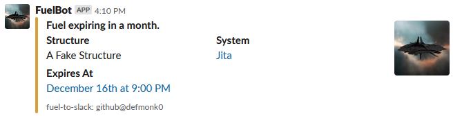

# fuel-to-slack

Post fuel notifications from Eve: Online's ESI API to Slack using local Node.js or AWS Lambda.

## Installation

### Local Node.js

- Clone the git repository. `git clone https://github.com/defmonk0/fuel-to-slack.git`
- Navigate into the created 'fuel-to-slack' directory. `cd fuel-to-slack`
- Install all dependencies using [npm](https://www.npmjs.com/). `npm install`
- Edit the configuration file to meet your needs (see [Environment Variables](#environment-variables)).
- Run the project using [npm](https://www.npmjs.com/) as well. `npm run start`
- If you want additional resistance to failure, consider using a node process manager.

### AWS Lambda

#### Using Releases

- Download the latest `Lambda.zip` from the [releases page](https://github.com/defmonk0/fuel-to-slack/releases).
- Create a new function in [AWS Lambda](https://aws.amazon.com/lambda/).
	- Use "Author from scratch".
	- The name is up to you.
	- Use Node.js (10.x) as your runtime.
	- The role you use shouldn't need any special permissions.
- After creating the function, upload your Lambda.zip file.
	- In the "Function code" section, you can change "Code entry type" drop-down to "Upload a .ZIP file".
	- Click the button, select your zip file, and then click the "Save" button in the top right of the window.
- Set up your environment variables to meet your needs (see [Environment Variables](#environment-variables)).
- Set up a trigger for your new function, or select an existing one.
	- In the "Designer" section, select "CloudWatch Events" on the left.
	- In the "Configure triggers" section, select "Create a new rule" from the drop-down (or select an existing one).
	- Supply a name and description however you want. This will be reusable in the future.
	- Supply a "Schedule expression" for how often you want the script to run. `rate(5 minutes)`
	- Click the "Add" button, and then click the "Save" button in the top right of the window.

#### Build From Master

- Clone the git repository. `git clone https://github.com/defmonk0/fuel-to-slack.git`
- Navigate into the created 'fuel-to-slack' directory. `cd fuel-to-slack`
- Install all dependencies using [npm](https://www.npmjs.com/). `npm install`
- Build a Lambda.zip using [npm](https://www.npmjs.com/) as well. It will be created in the "lambda" directory. `npm run build`
- Continue following the instructions for [Using Releases](#using-releases), ignoring the first step to download a release zip.

## Configuration

### Setup Instructions

#### Local Node.js

Simply edit the JSON file given in the node directory. `./node/config/environmentVariables.json`

Feel free to start using [npm](https://www.npmjs.com/). `npm start`

#### AWS Lambda

While editing a [Lambda](https://aws.amazon.com/lambda/) function, the "Environment variables" section allows you to supply key-value pairs. Create a key for each of the entries needed, and supply an associated value.

### Available Variables

- [required] alert_ranges (string)

	JSON parsable list of time ranges.
	Ranges should be the same length of time as your refresh time (default, 10 minutes).
	Any time the code executes and the remaining fuel time of a structure is in one of these ranges, a message will be sent.
	The default is 1 week, 1 day, and constantly under 1 hour.

	`"[[604800, 604200], [86400, 85800], [3600, 0]]"`

- [required] client_id (string)

	Client ID from an application created on the [Eve Developer Website](https://developers.eveonline.com/).

	`"796f757220636c69656e74206964"`

- [required] client_secret (string)

	Secret Key from an application created on the [Eve Developer Website](https://developers.eveonline.com/).

	`"eW91ciBkZXZlbG9wZXIgY2xpZW50IHNlY3JldCBrZXk"`

- [required] corp_id (string)

	ID of the corporation to check the structures of.
	Corporation IDs can be retrieved via a few options, including [ESI](https://esi.evetech.net/ui/#/Universe/post_universe_ids).

	`"2112625428"`

- [required] refresh (string)

	Refresh token for a character that can retrieve structure information for the selected corporation.
	An easy way to get a refresh token is via [postman](https://www.getpostman.com/).
	A guide on how to do this can be found [here](https://www.fuzzwork.co.uk/2017/03/14/using-esi-google-sheets/).

	`"eW91ciBjaGFyYWN0ZXIgcmVmcmVzaCB0b2tlbg=="`

- [required] slack_channel (string)

	The slack channel you wish to post to.

	`"#channel-name"`

- [required] slack_hook_url (string)

	The [Webhook URL](https://api.slack.com/incoming-webhooks) for your Slack [Custom Integration](https://slack.com/apps/manage/custom-integrations).

	`"https://hooks.slack.com/services/YOUR/SLACK/HOOK"`

- [required] user_agent (string)

	User agent to use when performing calls to oAuth and ESI.
	Can be left at default if you wish, or customized.

	`"fuel-to-slack/1.0.0 <https://github.com/defmonk0/fuel-to-slack>"`

## Example Slack Post

